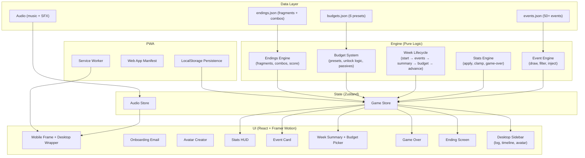

# LifePath Uni — Final Development Roadmap

> All questions resolved. Ready to execute.

---

## Decisions Locked In

| Decision | Answer |
|----------|--------|
| Event content | Hardcoded JSON deck, 50+ events |
| Budget mechanic | 4-6 presets, unlock/change based on money level |
| Avatar creator | Full — crop from existing 2x2 grid assets in `public/avatar/` |
| Art assets | ✅ All 5 backgrounds ready. ✅ 3 avatar grids ready (bodies, clothes, hair). ⚠️ Only feminine hair — need masculine hair grid |
| Onboarding & story | I design everything: narrative, characters, intros, endings |
| Endings | Full modular ending system (not simple summary) |
| Sound/Music | Yes — architect from the start |
| PWA | Yes — installable from day one |
| Desktop frame | I'll design it (themed university desk aesthetic around the phone frame) |

---

## Asset Inventory

### ✅ Ready to Use
| Asset | File | Contents |
|-------|------|----------|
| Base bodies | `public/avatar/character.png` | 2x2 grid: 4 skin tones (pale, olive, brown, dark) |
| Clothes | `public/avatar/clothes.png` | 2x2 grid: hoodie, varsity jacket, tank top, button-down |
| Hair (feminine) | `public/avatar/hairs.png` | 2x2 grid: short straight, long flowing, curly afro, messy bun |
| Dorm BG | `public/backgrounds/dorm.jpg` | Stylized 3D dorm room, 9:16 |
| Lecture BG | `public/backgrounds/class.jpg` | Stylized 3D lecture hall, 9:16 |
| Party BG | `public/backgrounds/party.jpg` | Stylized 3D party basement, 9:16 |
| Library BG | `public/backgrounds/library.jpg` | Stylized 3D library, 9:16 |
| Coffee Shop BG | `public/backgrounds/cafe.jpg` | Stylized 3D café, 9:16 |

### ⚠️ Needed — Prompts for You to Generate

**Masculine Hair Grid:**
> `A 2x2 grid showing four different masculine teen hairstyles from a front facing view, separated cleanly, identical scale. Top left: Short textured crop. Top right: Middle part curtain hair. Bottom left: Short dreads or fade. Bottom right: Messy fringe. No faces or bodies, just the hair floating, perfectly centered in each quadrant. with a transparent background, no background, aesthetic of a stylized premium 3D mobile simulation game, smooth clay-like digital textures, matte finish, soft global illumination lighting, crisp geometric architecture, flat blocks of pastel and vibrant accent colors, minimal surface details, clean untextured surfaces. Avoid specific university logos, avoid specific subject text, use abstract generic details for posters. NO HUMANS`

Save as: `public/avatar/hairs_male.png`

---

## Event Deck Generation Prompt

> [!IMPORTANT]
> **Copy the prompt below and give it to another agent to generate 50+ events as JSON.** Iterate with them until the deck feels complete. Then drop the final JSON file into the project.

```
You are writing the event deck for "LifePath Uni", a choice-driven university simulation game. The game tracks 4 stats on a 0-100 scale:

- **Health** (physical/mental wellbeing, sleep, stress, exercise)
- **Money** (bank balance, spending habits, income)
- **Grades** (academic performance, attendance, study time)
- **Social** (friendships, relationships, social rep, belonging)

## GAME CONTEXT
- The game simulates 15 weeks of a university semester.
- Each week has 1-5 random events drawn from this deck.
- Events are dilemmas — the player chooses between options. No choice is purely good or purely bad. Every choice has trade-offs.
- The tone is humorous but real — college stereotypes meet genuine life consequences. The game should feel relatable, stressful, and sometimes genuinely funny.
- The UI will NOT show stat changes before the player chooses — they must intuit consequences from the narrative text alone.

## EVENT STRUCTURE
Each event must follow this exact JSON schema:

{
  "id": "unique_snake_case_id",
  "title": "Short Punchy Title",
  "narrative": "2-3 sentence description of the situation. Written in second person ('You...'). Should paint a vivid, specific scene.",
  "scenario": "dorm" | "class" | "party" | "library" | "cafe",
  "weekRange": [1, 15],  // earliest and latest week this can appear
  "choices": [
    {
      "text": "Short action label (e.g., 'Stay and study')",
      "outcome": "1-2 sentence result narrative",
      "effects": { "health": 0, "money": 0, "grades": 0, "social": 0 }
    }
    // 2 choices for yes/no dilemmas, 4 choices for open-ended situations
  ]
}

## RULES FOR WRITING EVENTS
1. **NO EVENT IS FILLER.** Every event must feel like a genuine, interesting dilemma.
2. **HIDDEN CONSEQUENCES.** The choice text and narrative should hint at consequences without being explicit. "Pull an all-nighter" clearly implies health cost — but the choice text should just say "Pull an all-nighter", never "Pull an all-nighter (-10 Health, +15 Grades)".
3. **STAT EFFECTS RANGE.** Most effects should be between -15 and +15. Extreme events can go to -25/+25 but these should be rare (exam results, major crises).
4. **2 OR 4 CHOICES.** Binary go/don't-go dilemmas get 2 choices. More open-ended "what do you do?" situations get 4 choices.
5. **TRADE-OFFS.** No option should be obviously dominant. Each choice should sacrifice something to gain something else.
6. **VARIETY.** Spread events across all 5 scenarios (dorm, class, party, library, cafe). Include a mix of: academic pressure, social dynamics, money management, health/self-care, relationships, campus life, part-time work, impulsive decisions.
7. **WEEK RANGES.** Some events should be early-semester (Week 1-5: orientation, settling in), mid-semester (Week 6-10: midterms, routine), late-semester (Week 11-15: finals pressure, burnout). Generic events can span [1, 15].
8. **REALISM.** These should feel like things that actually happen to university students. Draw from real college experiences.
9. **HUMOR.** The game has a playful tone. Events can be dramatic but should have a wry, self-aware quality. Think "Sims meets real life".
10. **DIVERSITY.** Include events around different aspects of student life: roommates, commuting, laundry, cooking, dating, clubs/societies, sports, gaming, social media, family calls, homesickness, job interviews, deadlines, procrastination, etc.

## CONDITIONAL INJECTOR EVENTS
In addition to the generic deck, write 8 "crisis" events that trigger when specific stats get dangerously low (<15). These must have:
- "type": "injector"
- "condition": { "stat": "health|money|grades|social", "below": 15 }
- A sense of urgency in the narrative (this is a crisis, not a casual dilemma)
- Choices that offer a lifeline but always at a cost

Examples of crisis themes:
- Health <15: Collapse, burnout, hospital visit, forced rest
- Money <15: Card declined, can't afford food, bills overdue, eviction risk
- Grades <15: Academic probation, professor meeting, failing notice
- Social <15: Complete isolation, no one texts back, lonely breakdown

## OUTPUT FORMAT
Return a valid JSON array. No markdown wrapping. Just the raw JSON array of event objects.

Generate at least 50 generic events and 8 injector events (2 per stat).
```

---

## Phase 1: Foundation & Game Engine *(~2-3 sessions)*

> Pure logic layer. No UI. Fully testable.

| # | Task | Details |
|---|------|---------|
| 1.1 | **Project setup** | Install `zustand`, `framer-motion`, `lucide-react`. Set up folder structure: `src/engine/`, `src/store/`, `src/components/`, `src/screens/`, `src/data/`, `src/audio/`. |
| 1.2 | **CSS design system** | Color palette, typography (premium fonts via Google Fonts), spacing scale, CSS custom properties. "Clean & Playful" aesthetic. |
| 1.3 | **Game state store (Zustand)** | `currentWeek`, `currentDay`, `stats{}`, `eventQueue[]`, `resolvedEvents[]`, `gamePhase` enum, `avatar{}`, `budgetSelection`, `playerName`. |
| 1.4 | **Event engine** | Load JSON deck → filter by weekRange → random draw (1-5 per week) → check conditional injectors → build weekly queue. |
| 1.5 | **Stats engine** | Apply stat effects, clamping 0-100, game-over detection (health/money/grades hit 0), passive budget modifiers. |
| 1.6 | **Budget system** | 6 presets with stat modifiers. Presets unlock/lock based on current money. Applied as passive weekly drain/boost. |
| 1.7 | **Week lifecycle** | `startWeek()` → draw events → `resolveEvent(choiceIndex)` → repeat → `endWeek()` → show summary → select budget → `advanceWeek()`. |
| 1.8 | **Endings engine** | Evaluate final stats at week 15. Assemble modular ending from fragments based on stat ranges. Compute overall "life score". |

**Verification:** Unit tests for event drawing, stat clamping, game-over detection, budget application, ending assembly.

---

## Phase 2: Core UI Shell *(~2-3 sessions)*

> The game becomes visually playable.

| # | Task | Details |
|---|------|---------|
| 2.1 | **Mobile frame layout** | 9:16 phone-like container. Desktop wrapper with themed university desk/bulletin board background. |
| 2.2 | **Stats HUD** | Top bar: 4 stat icons (Lucide: `heart`, `banknote`, `graduation-cap`, `users`) with animated fill bars. Week counter. Day indicator. |
| 2.3 | **Event card screen** | Full-screen background image (from `public/backgrounds/`). Narrative text overlay with gradient scrim. 2 or 4 choice buttons. |
| 2.4 | **Choice feedback** | After choosing: brief outcome text reveal → stat change animation (bouncing numbers) → auto-advance to next event. |
| 2.5 | **Week summary screen** | Animated stat delta display (↑↓ arrows with color). Budget picker with 6 options (locked ones greyed out). "Next Week" button. |
| 2.6 | **Game over screen** | Cause-specific narrative + dramatic visual. "Bankrupt," "Hospitalized," "Academic Suspension" — each with unique text. |
| 2.7 | **Transition animations** | Framer Motion: card swipes, screen fades, stat bar bounces, week counter rolling. |

---

## Phase 3: Avatar Creator + Onboarding *(~2 sessions)*

> Character creation and narrative intro. Game is now a **complete MVP**.

| # | Task | Details |
|---|------|---------|
| 3.1 | **Avatar grid cropper** | Pre-process: slice each 2x2 PNG into 4 individual images at build time (or CSS `object-position` to show quadrants). |
| 3.2 | **Avatar creator UI** | Step-by-step flow: choose skin tone → choose hair → choose outfit. Live preview compositing layers via CSS stacking. |
| 3.3 | **Onboarding "Email" screen** | In-universe phone notification from an older sibling. Establishes premise, explains the 4 stats implicitly. Narrative I'll write. |
| 3.4 | **Name input** | Minimal name entry screen between onboarding and game start. |
| 3.5 | **Desktop sidebar** | Event log (scrollable history), current week timeline, avatar display. Fills the dead space on desktop. |

---

## Phase 4: Full Endings System *(~1-2 sessions)*

> Rich, modular, replayable endings.

| # | Task | Details |
|---|------|---------|
| 4.1 | **Ending fragments database** | JSON structure: stat ranges → text fragments. Each stat has 4 tiers: terrible (0-25), poor (26-50), good (51-75), excellent (76-100). |
| 4.2 | **Ending assembly engine** | Combines 4 fragments (one per stat) into a cohesive final narrative. Adds a "headline" outcome (e.g., "The Burnout Graduate," "The Campus Legend"). |
| 4.3 | **Modifiers and combos** | Special endings for stat combinations: all stats >80 ("The Perfect Student"), all <30 ("Rock Bottom"), high social + low grades ("The Popular Dropout"), etc. |
| 4.4 | **Ending screen UI** | Cinematic reveal: headline → stat-by-stat breakdown with narrative → overall life score → "Play Again" button. |
| 4.5 | **Ending achievements** | Track which endings the player has unlocked. Saved to localStorage. Visible from main menu. |

---

## Phase 5: Sound, Music & Polish *(~2 sessions)*

> Premium feel. This is what separates a game from a prototype.

| # | Task | Details |
|---|------|---------|
| 5.1 | **Audio system** | Zustand audio store: volume controls, mute toggle, categories (music, sfx). Use Web Audio API or Howler.js. |
| 5.2 | **Ambient music** | Different ambient loops per scenario: chill lo-fi for library/café, upbeat for party, quiet for dorm, lecture-hall ambiance. Crossfade on background change. |
| 5.3 | **UI sound effects** | Card flip, button tap, stat increase/decrease chimes, week transition whoosh, game-over sting, ending fanfare. |
| 5.4 | **Framer Motion polish pass** | Bouncy card transitions, staggered stat reveals, onboarding slide-in, avatar creator morph effects. |
| 5.5 | **Typography & color refinement** | Final premium font pairing. Color palette fine-tuning. Dark mode consideration. |
| 5.6 | **Accessibility** | Keyboard navigation, aria labels, `prefers-reduced-motion`, screen reader support for event text. |
| 5.7 | **Performance** | Lazy-load backgrounds, code-split screens, Lighthouse audit. |

---

## Phase 6: PWA & Deployment *(~1 session)*

> Ship it. Installable on any device.

| # | Task | Details |
|---|------|---------|
| 6.1 | **Web App Manifest** | Name, icons (192px + 512px), theme color, `display: standalone`, `orientation: portrait`. |
| 6.2 | **Service Worker** | Vite PWA plugin. Cache all game assets (backgrounds, avatars, audio). Full offline play. |
| 6.3 | **Install prompt** | Custom "Add to Home Screen" prompt at onboarding. |
| 6.4 | **Deploy** | Vercel or Netlify. SEO meta tags, Open Graph, favicon. |
| 6.5 | **Save system** | LocalStorage game state persistence. Resume interrupted games. |

---

## Architecture



---

## Folder Structure

```
app/src/
├── main.jsx                    # Entry point
├── App.jsx                     # Root component + screen router
├── index.css                   # Design system (CSS variables, base styles)
│
├── engine/                     # Pure logic (no React)
│   ├── events.js               # Event drawing, filtering, injection
│   ├── stats.js                # Stat application, clamping, game-over
│   ├── weeks.js                # Week lifecycle management
│   ├── budgets.js              # Budget preset logic
│   └── endings.js              # Ending assembly & scoring
│
├── store/                      # Zustand stores
│   ├── gameStore.js            # All game state
│   └── audioStore.js           # Audio state (volume, mute, current track)
│
├── data/                       # Static JSON data
│   ├── events.json             # 50+ events + 8 injectors
│   ├── budgets.json            # 6 budget presets
│   └── endings.json            # Ending fragments & combos
│
├── screens/                    # Full-screen views
│   ├── OnboardingScreen.jsx    # Email narrative + name input
│   ├── AvatarScreen.jsx        # Avatar creator
│   ├── EventScreen.jsx         # Event card display
│   ├── WeekSummaryScreen.jsx   # Stats recap + budget picker
│   ├── GameOverScreen.jsx      # Early game-over
│   └── EndingScreen.jsx        # Week 15 ending
│
├── components/                 # Reusable UI components
│   ├── MobileFrame.jsx         # 9:16 phone container
│   ├── DesktopWrapper.jsx      # Desktop layout with sidebar
│   ├── StatsHUD.jsx            # 4-stat top bar
│   ├── EventCard.jsx           # Event narrative + choices
│   ├── BudgetPicker.jsx        # Budget selection grid
│   ├── AvatarPreview.jsx       # Composited avatar display
│   ├── StatDelta.jsx           # Animated stat change indicator
│   └── AudioControls.jsx       # Volume/mute toggle
│
├── audio/                      # Audio management
│   └── audioManager.js         # Web Audio / Howler wrapper
│
└── utils/                      # Shared utilities
    ├── random.js               # Seeded RNG, weighted random
    └── avatarCropper.js        # CSS crop coordinates for 2x2 grids
```

---

## Timeline

| Phase | Sessions | Cumulative | Milestone |
|-------|----------|------------|-----------|
| 1: Engine | 2-3 | 2-3 | Game logic works, all unit tests pass |
| 2: Core UI | 2-3 | 4-6 | Visually playable game loop |
| 3: Avatar + Onboarding | 2 | 6-8 | **Complete MVP** — full game from start to finish |
| 4: Full Endings | 1-2 | 7-10 | Rich ending system with achievements |
| 5: Sound + Polish | 2 | 9-12 | Premium feel, accessible, performant |
| 6: PWA + Deploy | 1 | 10-13 | Live, installable, offline-ready |

---

## Immediate Next Steps

1. **You:** Generate the masculine hair grid using the prompt above → save as `public/avatar/hairs_male.png`
2. **You (or another agent):** Generate 50+ events using the event deck prompt above → I'll integrate the JSON
3. **Me:** Start executing **Phase 1** — installing dependencies, building the game engine

> [!TIP]
> Want me to start Phase 1 now?
